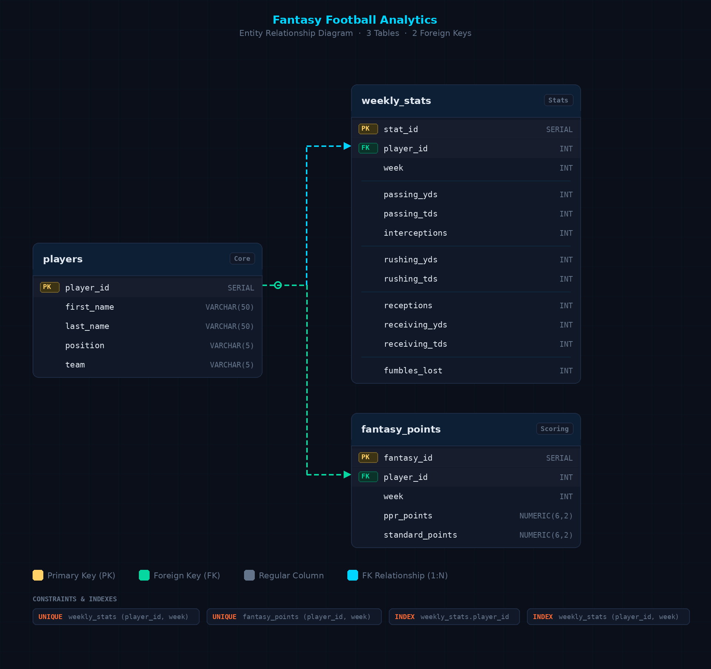

# Fantasy Football Analytics

**Personal Project | PostgreSQL, SQL, Data Analytics**

Analyze and rank NFL offensive players based on fantasy performance. This project demonstrates end-to-end database design, data ingestion, scoring logic, and analytics queries.

---

## Project Overview

This project simulates a **fantasy football analytics engine**:

- Stores **player information**, **weekly stats**, and **calculated fantasy points**.  
- Calculates **PPR (point-per-reception)** and **standard fantasy points**.  
- Generates **weekly rankings, positional leaderboards, average points, and consistency metrics**.  
- Designed to showcase **SQL skills** including table design, constraints, indexes, joins, aggregates, and window functions.

---

## Database Schema

### Tables

| Table | Description |
|-------|-------------|
| `players` | Stores player info (name, position, team). Primary key: `player_id`. |
| `weekly_stats` | Stores weekly performance stats (passing, rushing, receiving, turnovers). Linked to `players` via `player_id`. |
| `fantasy_points` | Stores calculated PPR and standard fantasy points per player per week. Linked to `weekly_stats` via `player_id` and `week`. |

---

## Entity Relationship Diagram

---

## Technologies & Skills Demonstrated

- **Database Design:** Relational schema with primary and foreign keys, indexes, and constraints.
- **SQL:** Aggregations (`AVG` , `STDDEV`), window functions (`RANK` , `PARTITION BY`, `LAG`), JOINs, INSERT statements, and SELECT statements.
- **Analytics:** Fantasy points calculation, weekly rankings, positional leaderboards, and player consistency.
- **Tools:** PostgreSQL, pgAdmin
- **Project Workflow:** Data ingestion -> Scoring -> Analytics -> Insights

---

## Next Steps

- Add more players and weeks to simulate an entire NFL season.
- Build visualizations in Python using database outputs.
- Add dynamic queries to compare PPR vs standard scoring.

---

## Usage

1. Clone the repository.
2. Run `schema.sql` to create tables.
3. Run `seed_data.sql` to populate sample data.
4. Run `fantasy_scoring.sql` to calculate fantasy points.
5. Run `analytics_queries.sql` to generate rankings and insights.

---

## Contact

Created by Michael John.  
Feel free to connect with me on [LinkedIn](https://www.linkedin.com/in/michael-john-06a098359/).
